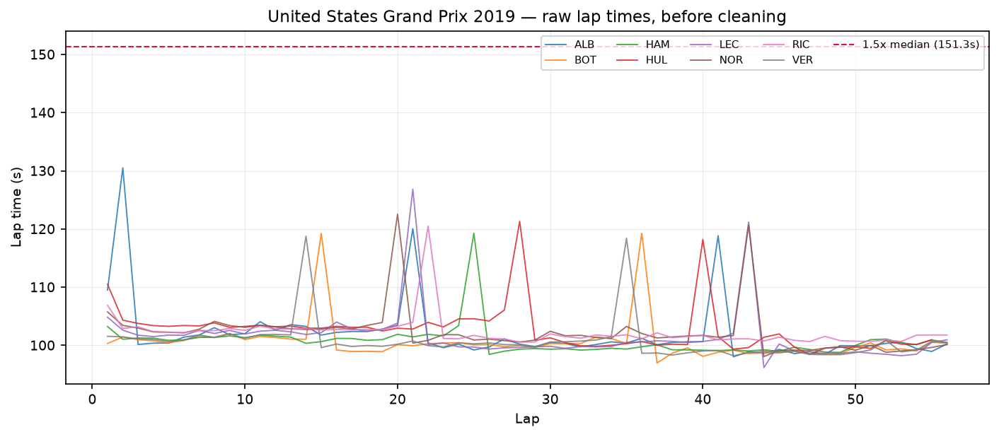
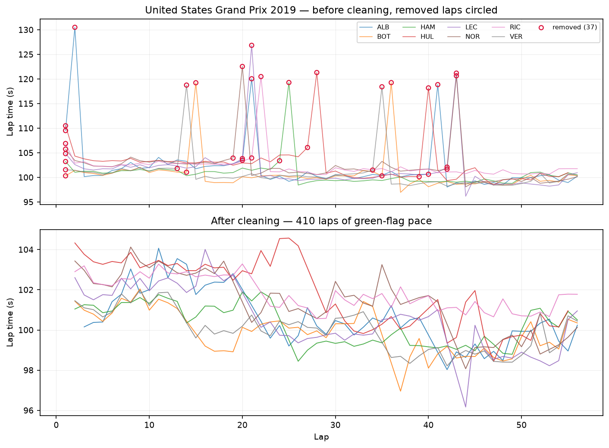
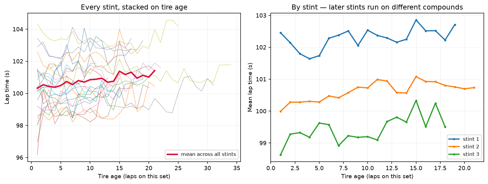
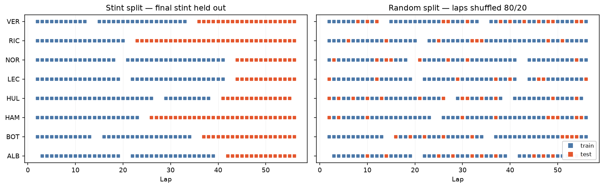
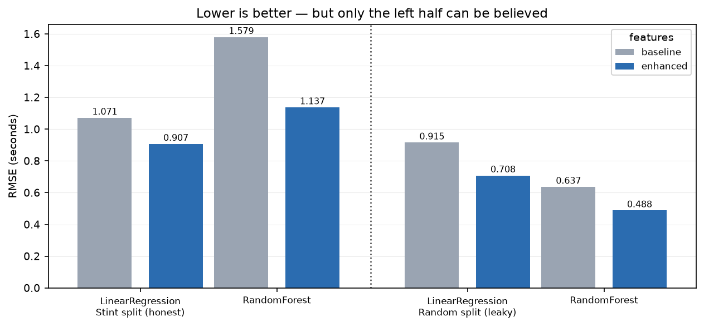
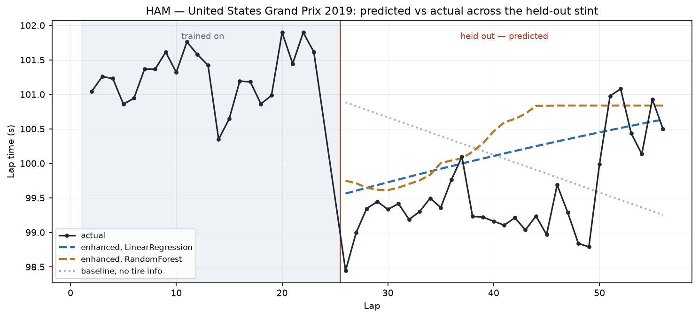
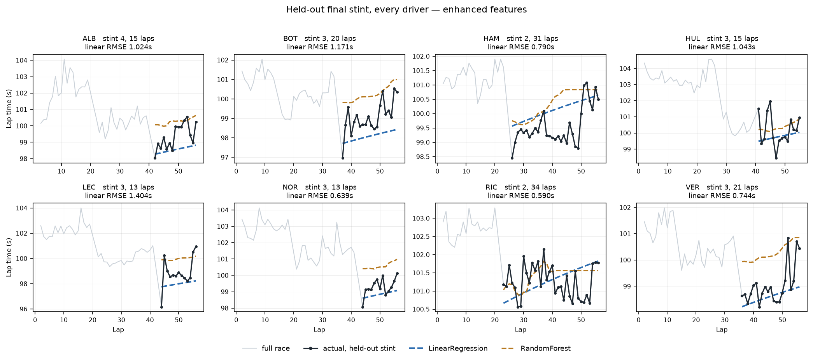

# F1 Lap Time Predictor

Predicting lap times within a single Formula 1 race, and testing whether tire
age explains pace beyond what fuel burn and starting position already explain.

Submitted for **GitHub Community SRM (GCSRM) Recruitment 2026**, Technical
Track: AI & Machine Learning (Year 1), Option A.

---

## Research question

> Within one dry Grand Prix, does a lap time model improve when it knows how
> old the tires are, after fuel burn and grid position are already accounted
> for, and is that improvement real or an artifact of how the data was split?

The second half of that question matters as much as the first. A random
train/test split on lap data leaks: consecutive laps are nearly identical, so a
model tested on lap 24 has almost certainly trained on laps 23 and 25. This
project reports both splits side by side to show the size of that illusion.

## The answer

**Yes, and the improvement survives an honest split.** Measured on held-out
final stints, adding tire age cuts RMSE from 1.071s to 0.907s, a 15.4%
improvement, and the linear model attributes **+0.127s per lap** to tire wear
against **-0.085s per lap** returned by fuel burn. The two effects nearly
cancel, which is why they have to be modelled together.

**Three findings beyond the brief:**

1. **A random split reverses the verdict, it does not merely flatter it.** Under
   a random split RandomForest looks 31% better than linear regression. Under
   the honest split linear regression is 20% better than RandomForest. A
   careless split would lead to shipping the wrong model, not just to quoting an
   optimistic number.
2. **The leak is measured, not asserted.** 95.1% of randomly-split test laps
   have an immediately adjacent lap sitting in the training set. Under the stint
   split that figure is 0.0%.
3. **A planned feature was deleted after being measured.** The intended fuel
   proxy correlates with lap number at exactly -1.000, because within one race
   they are the same quantity. Lap number already is the fuel control, which is
   what makes the baseline comparison fair.

---

## Status

| Phase | Description | State |
| :---- | :---------- | :---- |
| 0 | Environment, repository scaffold, dataset | Done |
| 1 | Race selection and lap extraction | Done |
| 2 | Cleaning: pit laps, out-laps, outliers | Done |
| 3 | Feature engineering: tire age, stint, degradation shape | Done |
| 4 | Stint-based split plus random-split control | Done |
| 5 | Model comparison: baseline vs tire-aware | Done |
| 6 | Figures | Done |
| 7 | Write-up | Done |

---

## Setup

```bash
pip install -r requirements.txt
python scripts/download_data.py
```

The dataset is the Ergast Motor Racing Database CSV export, which is the
upstream source of the Kaggle dataset "Formula 1 World Championship (1950 to
2020)" named in the brief. Ergast retired its own download endpoint, so
`scripts/download_data.py` pulls the identical archive from a public mirror.
This keeps the repository reproducible without Kaggle credentials.

Verify the loader:

```bash
python src/data_loader.py
```

### A note on `races.csv`

The published archive ships a `races.csv` whose header row lists 8 columns
while every data row carries 18. Reading it with pandas' default header
silently shifts every field and turns `year` into a column of timestamp
strings. `src/data_loader.py` restores the true schema. Any analysis that
filters on `year` without this fix returns zero rows.

---

## Repository layout

```
data/raw/     Ergast CSV tables (not committed; rebuilt by the download script)
scripts/      download_data.py
src/          data_loader, race_selection, dataset, cleaning, features, splits, models
notebooks/    00 environment .. 06 figures, one per phase, all executed
figures/      seven generated plots
results/      twelve CSV tables: race scoring, cleaning counts, model comparison
```

Every module in `src/` runs standalone and prints its own summary, so any stage
can be checked without opening a notebook:

```bash
python src/race_selection.py
python src/cleaning.py
python src/models.py
```

---

## Methodology

### Race selection

**Chosen: the 2019 United States Grand Prix, Circuit of the Americas, 56 laps.**

The brief asks for a dry race with no red flags. Rather than picking one from
reputation, every 2019 race was scored on four signals visible in the lap data
itself: lap-time variation as a wetness proxy, the share of laps beyond 1.5x
the field median, the slowest field-median lap relative to the race median, and
mid-race attrition. `src/race_selection.py` does the scoring and
`results/race_selection_2019.csv` holds the full table.

Austin wins on the measurements that matter:

| Signal | Austin | Season position |
| :--- | ---: | :--- |
| Slowest lap, as a multiple of race median | 1.073 | lowest of 21 |
| Lap-time variation (wetness proxy) | 0.0373 | 2nd lowest |
| Laps beyond 1.5x the field median | 0.0000 | joint lowest |
| Mid-race retirements | 1 | joint lowest |

Eight races survive the filter. The tiebreaker is experimental design. Most
Austin finishers ran three stints, which gives two training stints and one
held-out final stint per driver at roughly a 60/40 split of laps. The 2019
Austrian Grand Prix scores just as clean, but almost every driver ran a single
stop, leaving one training stint each and a test set larger than the training
set.

**Two measurement traps, both of which changed the answer.** A first pass
measured red flags as the largest drop in cars circulating between consecutive
laps. That flags nearly every clean race, because the leader finishes before
the cars they lapped, so the field appears to collapse at the flag; attrition
is now measured only up to three laps from the end. Separately, with wetness
used only to rank rather than to filter, the 2019 German Grand Prix passed:
its disruption and attrition are low, yet it was the wettest race of the
season, with 78 pit stops.

**Why not Bahrain.** It is the natural first choice and it fails the filter, on
a 1.345x lap spike and three mid-race retirements. That is the late safety car
and the leader's engine failure, and those laps would carry neutralised running
that has nothing to do with tire wear.

### Drivers

Eight, the highest finishers who were classified, ran within one lap of the
full distance, made at least two stints, and had at least 10 laps in the final
stint and 20 before it.

| Code | Driver | Grid | Finish | Stints | Train laps | Test laps |
| :--- | :--- | ---: | ---: | ---: | ---: | ---: |
| BOT | Bottas | 1 | 1 | 3 | 35 | 21 |
| HAM | Hamilton | 5 | 2 | 2 | 24 | 32 |
| VER | Verstappen | 3 | 3 | 3 | 34 | 22 |
| LEC | Leclerc | 4 | 4 | 3 | 42 | 14 |
| ALB | Albon | 6 | 5 | 4 | 40 | 16 |
| RIC | Ricciardo | 9 | 6 | 2 | 21 | 35 |
| NOR | Norris | 8 | 7 | 3 | 42 | 14 |
| HUL | Hülkenberg | 11 | 9 | 3 | 39 | 17 |

447 laps in total, uncleaned median 100.861s.



The raw trace shows the expected sawtooth: pace decaying through each stint,
a tall spike on the lap the car pitted, then the pattern restarting on fresh
tires. The spikes are staggered across drivers rather than aligned, which is
the visual confirmation that no safety car neutralised the race.

### Cleaning

37 of 447 laps removed, 8.3%, each attributable to a named rule.
`results/cleaning_report.csv` holds the table.

| Rule | Why | Laps |
| :--- | :--- | ---: |
| `pit_in` | The lap the car entered the pit lane, which contains the stop | 15 |
| `pit_out` | The lap after, begun at pit-lane speed on cold tires | 15 |
| `outlier` | Slower than 1.5x that driver's own median | 0 |
| `lap_one` | The opening lap, begun from a standstill | 8 |
| | **Total unique laps removed** | **37** |

The outlier test uses each driver's own median rather than the field median, so
a slower car is not penalised for being slower.

**The outlier rule removes nothing, and that is the correct result.** It exists
to catch safety cars and off-track moments. This race has neither, which is
exactly why Phase 1 selected it. The threshold sits near 151s and the slowest
green-flag lap is 47s clear of it. A count of zero is evidence the race
selection worked, not evidence the rule was misapplied.

**Lap 1 is an addition to the brief, not part of it.** It begins from a
standstill and includes the first-corner scramble, making it 4.6s slower than a
green-flag lap. That is a starting-procedure effect, not a tire effect. It
matters more than an ordinary outlier because lap 1 is always run on brand new
tires: keeping it would place a very slow lap at a tire age of zero for every
driver and teach the model that fresh tires are slow, which inverts the effect
being measured. Removing it also pulls the slowest remaining lap from 110.5s
down to 104.6s.



The lower panel is what the models see. The sawtooth is gone. What remains is a
gentle downward drift, which is fuel burn, overlaid with a repeating rise inside
each stint, which is tire wear. Separating those two is the whole problem.

### Features

Three features are derived. A fourth was planned and deliberately dropped.

| Feature | Meaning |
| :--- | :--- |
| `stint_number` | Which set of tires, counting from 1. Teams run different compounds in different stints, so this carries compound information the dataset does not expose directly. |
| `tire_age` | Laps completed on the current set, resetting at each stop. The feature the project exists to test. |
| `tire_age_sq` | Tire age squared. A set loses little early and falls away faster once the surface is gone. A linear term alone cannot bend to that. |

**The fuel proxy was dropped, and that is the finding.** The plan was to add
`fuel_proxy = total_laps - lap` so the model could separate fuel burn from tire
wear. Within a single race `total_laps` is constant, which makes that column an
exact linear transform of `lap`. Their measured correlation is **-1.000**. The
two carry identical information, and in a linear model the pair is perfectly
collinear, so the coefficients stop being identifiable.

The useful conclusion runs the other way:

> Within one race, **lap number already is the fuel proxy.** It also absorbs
> track evolution as rubber goes down. Both effects are monotonic in lap number
> and cannot be separated from it without data from more than one race.

This is what makes the Phase 5 comparison fair. The baseline already has
`lap_number`, so it already controls for fuel burn and track evolution. Any
improvement from `tire_age` is therefore attributable to the tires rather than
to a fuel effect the baseline was missing.

`results/fuel_collinearity.csv` records the check.

**Correlations with lap time**

| Feature | Correlation |
| :--- | ---: |
| `stint_number` | -0.724 |
| `lap` | -0.623 |
| `grid` | +0.467 |
| `tire_age` | +0.172 |
| `tire_age_sq` | +0.144 |

The signs are the whole story. Lap number is negative, because fuel burn and
track evolution make the cars faster as the race runs. Tire age is positive,
because degradation makes them slower. The two effects work against each other,
which is exactly why the baseline needs `lap_number` for the comparison to mean
anything.



Averaged across every stint, a set of tires costs **1.10s** between its first
lap and its twenty-first. The right-hand panel separates the stints: each sits
at a lower level than the one before, which is fuel burn, and each still rises
within itself, which is tire wear.

**Tire age resets correctly in every stint.** Tire age is 0 on the out-lap and
1 on the lap after. Cleaning removes every out-lap, and removes lap 1 which is
the opening stint's equivalent, so all 23 surviving stints begin at 1. Albon
has no first stint at all: he pitted on lap 2, so his opening stint is lap 1
alone and cleaning removes it. That is the data behaving correctly.

### Splitting strategy

Two splits are built. One is used to draw conclusions; the other exists only so
its failure can be measured.

**Stint split.** Each driver's final stint is held out and everything before it
trains. A stint is a contiguous block of laps on one set of tires, so holding
one out asks the model to predict a run of the race it has never seen.

**Random split.** Laps shuffled and cut 80/20, which is what a default
`train_test_split` call produces.

| Split | Train | Test | Test share | Test laps with a neighbour in training |
| :--- | ---: | ---: | ---: | ---: |
| Stint | 248 | 162 | 39.5% | **0.0%** |
| Random | 328 | 82 | 20.0% | **95.1%** |

**The last column names the mechanism.** Consecutive laps by the same driver on
the same set of tires differ by a few tenths of a second. If laps 23 and 25 sit
in training, predicting lap 24 is not prediction, it is interpolation between
two nearly identical points, and any model will look excellent at it. Under the
random split that situation holds for 95.1% of test laps.

The stint split scores exactly zero by construction. A held-out stint is
bounded by a pit stop on one side and the end of the race on the other, and
cleaning already removed the laps at those boundaries, so nothing adjacent
survives in training.



The left panel holds out a solid block at the end of each driver's race. The
right panel scatters test laps through the field, each surrounded by training
laps. That picture is the leak.

**Two costs the stint split pays, honestly.** It puts 39.5% of laps in the test
set rather than the usual 20%, because a final stint is simply a large share of
a race. And it forces extrapolation: held-out stints reach a tire age of 34,
beyond much of what the training stints cover. Both make the stint split look
worse on paper, and both are the reason its score can be believed.

Neither split lets a lap appear in both sets; `assert_disjoint` checks it.

### Models and metrics

Two feature sets, two algorithms, two splits.

| Feature set | Columns |
| :--- | :--- |
| `baseline` | `grid`, `lap` |
| `enhanced` | `grid`, `lap`, `tire_age`, `tire_age_sq`, `stint_number` |

`LinearRegression` was chosen for interpretability: its coefficients read
directly in seconds, and it extrapolates, which matters because held-out stints
reach tire ages beyond the training range. `RandomForestRegressor` was chosen
as a contrasting non-linear learner.

---

## Results

`results/model_comparison.csv` holds the full table.

| Split | Features | Algorithm | RMSE | MAE |
| :--- | :--- | :--- | ---: | ---: |
| **stint** | baseline | LinearRegression | 1.071 | 0.866 |
| **stint** | **enhanced** | **LinearRegression** | **0.907** | **0.703** |
| stint | baseline | RandomForest | 1.579 | 1.300 |
| stint | enhanced | RandomForest | 1.137 | 0.938 |
| random | baseline | LinearRegression | 0.915 | 0.742 |
| random | enhanced | LinearRegression | 0.708 | 0.543 |
| random | baseline | RandomForest | 0.637 | 0.417 |
| random | enhanced | RandomForest | 0.488 | 0.379 |



### Finding 1 — tire age helps, in every pairing

| Split | Algorithm | Baseline RMSE | Enhanced RMSE | Gain |
| :--- | :--- | ---: | ---: | ---: |
| stint | LinearRegression | 1.071 | 0.907 | **15.4%** |
| stint | RandomForest | 1.579 | 1.137 | 28.0% |
| random | LinearRegression | 0.915 | 0.708 | 22.7% |
| random | RandomForest | 0.637 | 0.488 | 23.4% |

**The headline number is 15.4%**, from the stint split with linear regression.
That is the one measured without leakage, so it is the one worth quoting.

### Finding 2 — the leak reverses the verdict, it does not merely flatter it

This is the most important result in the project.

| Split | LinearRegression | RandomForest | Apparent winner |
| :--- | ---: | ---: | :--- |
| Random (leaky) | 0.708 | **0.488** | RandomForest, by 31% |
| Stint (honest) | **0.907** | 1.137 | LinearRegression, by 20% |

A random split does not just report an over-optimistic score. It would lead to
shipping the **wrong model**. RandomForest looks like the clear winner under
leakage and is in fact the worse of the two once the leak is closed.

The mechanism is direct. A tree predicts by averaging the training points that
fall in the same leaf. When 95.1% of test laps have an immediate neighbour in
training, the nearest leaf already contains nearly the answer, so memorisation
scores extremely well. RandomForest's score is inflated **57%** by the leak;
the linear model's by **22%**. The more flexible learner is the one the leak
rewards most, which is what makes a flexible model plus a careless split so
dangerous.

### Finding 3 — RandomForest loses honestly because it cannot extrapolate

| Training max tire age | Test max tire age | Test laps beyond training range |
| ---: | ---: | ---: |
| 25 | 34 | 15 of 162 |

Final stints run longer than earlier ones, so the stint split necessarily asks
for extrapolation. A tree cannot extend a trend: past the edge of its training
range every branch returns its nearest leaf, so the prediction flattens exactly
where degradation is steepest. A linear model keeps extending its slope, which
is the correct behaviour here. This is a limitation of the split as much as of
the tree, and it is reported rather than engineered away.

### What the linear model learned

| Effect | Coefficient | Reading |
| :--- | ---: | :--- |
| `tire_age` | **+0.127 s/lap** | each extra lap on a set costs about an eighth of a second |
| `lap` | **-0.085 s/lap** | fuel burn and track evolution give back about a twelfth of a second per lap |
| `grid` | +0.211 s/place | a car starting one place further back is about a fifth of a second slower |

**The two effects are separated, which is what the project set out to do.** Tire
wear and fuel burn nearly cancel: net visible degradation is about 0.042s per
lap, roughly 0.8s over a 20-lap stint. Phase 3 measured raw observed
degradation at 1.10s across 21 laps of tire age, so the two agree.

That near-cancellation is exactly why the baseline needs `lap`. Without it, tire
wear and fuel burn would be confounded and the measured degradation would be
wrong by a factor of three.

**The quadratic term did almost nothing.** `tire_age_sq` comes out at -0.0002,
so the marginal cost of one more lap falls only from 0.126s at age 1 to 0.119s
at age 20. Degradation at this race is very nearly linear across the range
observed. The term was worth including to test for a curve, and the honest
result is that there is barely one.

### Predicted against actual



Hamilton's full race, with the shaded region showing what the models trained on
and everything right of the red line held out. Three things are visible at once:

- **The baseline, dotted grey, slopes the wrong way.** With no tire
  information it can only follow fuel burn, so it predicts the car getting
  steadily faster while it is in fact getting slower.
- **The enhanced linear model, blue, gets the direction right** and tracks the
  real upward drift across 31 unseen laps.
- **RandomForest, gold, flattens completely from lap 44.** That is the
  extrapolation limit made visible: beyond the training tire-age range the tree
  returns its nearest leaf and stops following the trend, exactly where
  degradation is steepest.



The same comparison for every driver, so the single-driver figure can be checked
rather than trusted. `results/per_driver_rmse.csv` holds the numbers.

| Code | Held-out stint | Test laps | Linear RMSE | Forest RMSE | Baseline RMSE |
| :--- | ---: | ---: | ---: | ---: | ---: |
| RIC | 2 | 34 | **0.590** | 0.510 | 0.673 |
| NOR | 3 | 13 | **0.639** | 1.369 | 1.191 |
| VER | 3 | 21 | **0.744** | 1.377 | 1.006 |
| HAM | 2 | 31 | **0.790** | 1.046 | 1.146 |
| ALB | 4 | 15 | **1.024** | 1.129 | 1.064 |
| HUL | 3 | 15 | 1.043 | **0.981** | 1.334 |
| BOT | 3 | 20 | 1.171 | 1.360 | **1.071** |
| LEC | 3 | 13 | 1.404 | 1.567 | **1.344** |
| | | **mean** | **0.926** | 1.167 | 1.104 |

**The enhanced linear model wins for six of eight drivers**, against both the
baseline and the forest. It loses to the baseline for Bottas and Leclerc, whose
held-out stints are among the noisiest. Reporting six of eight rather than an
aggregate alone is the honest form: the aggregate improvement is real, and it is
not uniform.

---

## Limitations

Stated plainly, because each one bounds what the results above can claim.

**One race, so the findings are about this race.** Austin in 2019 was warm and
abrasive. Degradation of 0.127s per lap is a property of that surface and those
compounds, not a general constant. The method transfers; the number does not.

**Tire compound is never observed.** The dataset records no compound, so
`stint_number` stands in for it. That works because teams generally run softer
tires earlier, but it conflates compound with race progress and with fuel load.
A genuine compound column would separate them.

**Fuel load cannot be isolated within one race.** Fuel burn, track evolution and
lap number are the same monotonic quantity here, so the `lap` coefficient of
-0.085s is their combined effect and cannot be decomposed further. Doing so
needs multiple races.

**The stint split forces extrapolation.** Final stints run longer than earlier
ones, so 15 of 162 test laps sit beyond the training tire-age range of 25. This
penalises RandomForest heavily and flatters linear regression's willingness to
extend a straight line. It is an honest test, but it is not a neutral one
between those two model families.

**Eight drivers, 410 laps.** Small enough that per-driver results move around:
the enhanced model wins for six of eight and loses to the baseline for two. The
aggregate gain is real and it is not uniform.

**Driver skill and traffic are unmodelled.** `grid` is a crude stand-in for car
and driver pace, and nothing captures being stuck behind a slower car. Leclerc's
held-out stint has the worst RMSE of the eight at 1.404s, and traffic is the
most likely explanation.

---

## What I would do next

In rough order of what would move the result most.

1. **Repeat across a full season.** Fitting the same model to ten dry races
   would separate fuel burn from track evolution, because the two scale
   differently with race length, and would show whether 0.127s per lap is
   typical or particular to Austin.
2. **Join a compound source.** Compound is the single largest missing variable.
   `stint_number` is a proxy that carries three confounded effects.
3. **Model each driver's own baseline pace.** A per-driver intercept would
   remove car and driver differences from the residuals and isolate degradation
   more cleanly than `grid` does.
4. **Add a traffic feature.** The gap to the car ahead, reconstructed from
   position and lap time, would explain the residuals that currently look like
   noise.
5. **Test a model that extrapolates and bends.** Linear regression extends a
   trend but cannot curve; RandomForest curves but cannot extend. A monotonic
   spline or a simple parametric degradation curve would do both.

---

## Data source

Ergast Motor Racing Database, covering 1950 to March 2022, mirrored at
[rubenv/ergast-mrd](https://github.com/rubenv/ergast-mrd). Used under the
Ergast terms for non-commercial purposes.
